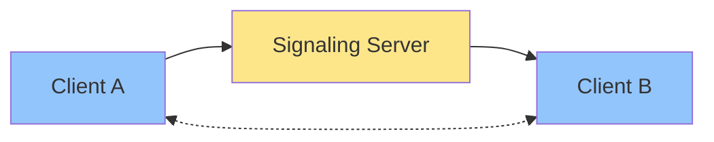
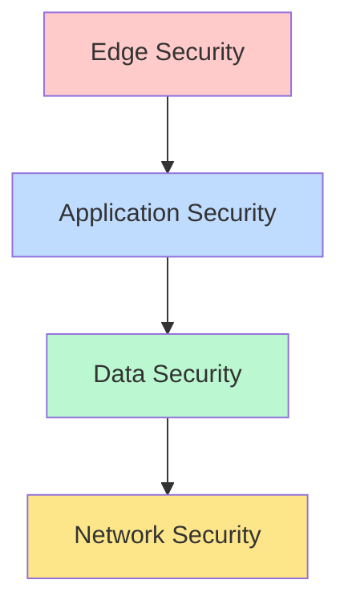

# WebRTC Video Counseling Platform

> A secure, high-performance video counseling platform powered by React, Node.js, and WebRTC technology. This platform enables real-time video communication with enterprise-grade security and performance optimizations.

<div align="center">

[](https://reactjs.org/)
[](https://nodejs.org/)
[](https://webrtc.org/)
[](https://www.docker.com/)

</div>

## Table of Contents

- [Key Features](#key-features)
- [Architecture](#architecture)
- [Getting Started](#getting-started)
- [Development](#development)
- [Security](#security)
- [Performance](#performance)
- [Deployment](#deployment)
- [Contributing](#contributing)
- [License](#license)

## Key Features

### Real-time Video Communication

Our platform leverages WebRTC technology to provide:

- **WebRTC-powered Video Streaming**: Direct peer-to-peer communication with low latency
- **Adaptive Quality Optimization**: Dynamic adjustment of video quality based on network conditions
- **Multi-participant Support**: Reliable handling of multiple concurrent video sessions
- **Screen Sharing**: Built-in support for screen sharing and presentation modes
- **Recording Capabilities**: Optional session recording with secure storage

### Enterprise Security

Comprehensive security measures including:

- **End-to-end Encryption**: All communications are encrypted using industry-standard protocols
- **Secure Authentication**: Multi-factor authentication support with JWT implementation
- **Role-based Access Control**: Granular permission system for different user types
- **Data Privacy**: GDPR and HIPAA compliance measures
- **Audit Logging**: Detailed activity logging for security monitoring

### Smart Optimization

Advanced performance features:

- **Network Condition Adaptation**: Real-time bandwidth monitoring and adjustment
- **Automatic Quality Scaling**: Smart video quality management based on device capabilities
- **Bandwidth Management**: Efficient use of available network resources
- **Connection Recovery**: Automatic reconnection handling during network issues
- **Quality Metrics**: Real-time monitoring of connection quality

### Advanced Capabilities

Additional platform features:

- **File Sharing**: Secure file transfer with automatic compression
- **Redis Caching**: High-performance caching for improved response times
- **Comprehensive Monitoring**: Full system health and performance tracking
- **Analytics Dashboard**: Usage statistics and system performance metrics
- **API Integration**: RESTful APIs for external system integration

## Architecture

### WebRTC Communication Flow



The WebRTC communication process follows these steps:

1. **Signaling Phase**

   - Clients establish initial connection with signaling server
   - Exchange of session parameters and capabilities
   - NAT traversal setup through STUN/TURN servers

2. **Connection Establishment**

   - SDP (Session Description Protocol) exchange
   - ICE (Interactive Connectivity Establishment) candidate sharing
   - Media codec negotiation and selection

3. **Direct Communication**
   - Peer-to-peer connection establishment
   - Media stream initialization
   - Continuous quality monitoring and adaptation

### System Components

#### Client Architecture

The React frontend implements:

- **Modern UI/UX Components**
  - Responsive video containers
  - Adaptive layout system
  - Real-time status indicators
  - Accessibility features
- **State Management**
  - Redux for application state
  - WebRTC state handling
  - Real-time updates
- **Media Handling**
  - Camera/microphone management
  - Screen sharing controls
  - Quality selection interface

#### Server Components

The backend infrastructure consists of:

**Signaling Server**

- WebSocket management for real-time communication
- Session state coordination
- Client synchronization
- Connection brokering
- Presence management

**Media Server**

- Stream processing and optimization
- Recording service management
- Broadcasting capabilities
- Media quality enhancement
- Stream redundancy handling

### Security Architecture



## Getting Started

### Prerequisites

Ensure you have the following installed:

- **Docker & Docker Compose**: For containerized deployment
- **Git**: For version control
- **Node.js 18+**: For local development

### Quick Setup

1. Clone Repository

```bash
git clone <repository-url>
cd WebRTC-demo
```

2. Environment Setup

```bash
# Copy and configure environment files
cp server/.env.example server/.env
cp client/.env.example client/.env

# Configure the following in .env files:
# - Database credentials
# - STUN/TURN server settings
# - API keys and secrets
# - Media server configuration
```

3. Launch Application

```bash
docker-compose up
```

Access Points:

- Frontend: http://localhost:3000 (Web interface)
- Backend: http://localhost:5000 (API endpoint)
- Admin: http://localhost:9001 (Admin dashboard)

## Development

### Project Structure

```
WebRTC-demo/
├── client/           # React frontend
│   ├── src/         # Source code
│   │   ├── components/  # React components
│   │   ├── redux/      # State management
│   │   ├── services/   # API services
│   │   └── utils/      # Utility functions
│   ├── public/      # Static assets
│   └── Dockerfile   # Client container
├── server/          # Node.js backend
│   ├── src/         # Source code
│   │   ├── controllers/  # Request handlers
│   │   ├── models/      # Data models
│   │   ├── services/    # Business logic
│   │   └── utils/       # Utilities
│   ├── migrations/  # Database migrations
│   └── Dockerfile   # Server container
└── docker-compose.yml  # Container orchestration
```

### Development Commands

```bash
# Start services
docker-compose up

# Database Management
docker-compose exec server npm run migrate up   # Run migrations
docker-compose exec server npm run migrate down # Rollback migrations
docker-compose exec server npm run seed         # Seed test data

# Testing
docker-compose exec client npm test    # Run frontend tests
docker-compose exec server npm test    # Run backend tests
docker-compose exec server npm run e2e # Run E2E tests

# Code Quality
docker-compose exec client npm run lint    # Frontend linting
docker-compose exec server npm run lint    # Backend linting
docker-compose exec client npm run format  # Format frontend code
docker-compose exec server npm run format  # Format backend code
```

## Performance Features

### Optimization Stack

Our performance optimization includes:

- **Connection Pooling**

  - Database connection management
  - WebSocket connection pooling
  - Resource utilization optimization

- **Redis Caching**

  - Session state caching
  - API response caching
  - Real-time data synchronization

- **Media Optimization**

  - Video compression
  - Audio quality enhancement
  - Bandwidth adaptation

- **System Performance**
  - Load balancing
  - Auto-scaling support
  - Resource monitoring

### Quality Management

```
┌─────────────┐      ┌─────────────┐
│   Network   │─────▶│   Quality   │
│  Monitor    │      │  Adapter    │
└─────────────┘      └─────────────┘
       │                    │
       ▼                    ▼
┌─────────────┐      ┌─────────────┐
│   Stream    │◀─────│   Media     │
│  Optimizer  │      │  Encoder    │
└─────────────┘      └─────────────┘
```

The quality management system continuously monitors and adjusts:

- Network conditions and bandwidth
- Video resolution and frame rate
- Audio quality and bitrate
- Connection stability
- Resource utilization

## Deployment

### Production Setup

```bash
# Launch production environment
docker-compose -f docker-compose.prod.yml up -d

# Monitor application logs
docker-compose -f docker-compose.prod.yml logs -f
```

### Scaling Strategy

The platform supports horizontal scaling through:

- **Load Balancing**: Distribution of client connections
- **Database Replication**: Read/write splitting
- **Media Server Clustering**: Distributed media processing
- **Performance Monitoring**: Real-time system metrics

## Contributing

1. Fork repository
2. Create feature branch
3. Commit changes
4. Push to branch
5. Open Pull Request

Please ensure your contributions:

- Follow the existing code style
- Include appropriate tests
- Update documentation
- Address security considerations

## License

This project is licensed under the MIT License - see the [LICENSE](LICENSE) file for details.

---

<div align="center">
Made with ❤️ by the WebRTC Team
</div>
