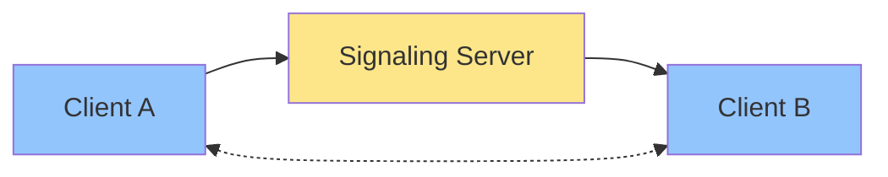
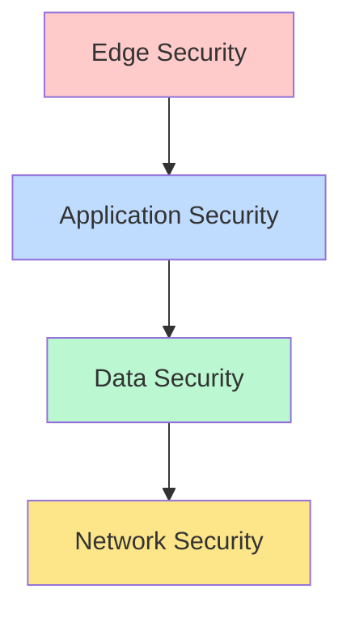

# 🌟 WebRTC Video Counseling Platform

> 🎯 A secure, high-performance video counseling platform powered by React, Node.js, and WebRTC technology.

## 📑 Table of Contents

- [✨ Key Features](#-key-features)
- [🏗️ Architecture](#️-architecture)
- [🚀 Getting Started](#-getting-started)
- [💻 Development](#-development)
- [🔐 Security](#-security)
- [⚡ Performance](#-performance)
- [📦 Deployment](#-deployment)
- [🤝 Contributing](#-contributing)
- [📄 License](#-license)

## ✨ Key Features

- 🎥 **Real-time Video Communication**

  - WebRTC-powered video streaming
  - Adaptive quality optimization
  - Multi-participant support

- 🔒 **Enterprise Security**

  - End-to-end encryption
  - Secure authentication
  - Role-based access control

- 📊 **Smart Optimization**

  - Network condition adaptation
  - Automatic quality scaling
  - Bandwidth management

- 🛠️ **Advanced Capabilities**
  - File sharing with optimization
  - Redis-powered caching
  - Comprehensive monitoring

## 🏗️ Architecture

### 🔄 WebRTC Communication Flow

#### 1️⃣ Initial Signaling

- 🤝 Client connection establishment
- 📡 Parameter exchange
- 🔐 Secure channel setup

#### 2️⃣ Connection Setup

- 📝 SDP exchange
- 🧊 ICE candidate sharing
- 🎛️ Media capability negotiation

#### 3️⃣ P2P Connection

- 🔗 Direct peer connection
- 🎥 Media streaming
- 📊 Network optimization

### 🏢 System Components

#### 🖥️ Client Architecture

- **React Frontend**
  - 🎨 Modern UI/UX
  - 📱 Responsive design
  - 🔄 Redux state management

#### ⚙️ Server Components

- **Signaling Server**

  - 🔌 WebSocket management
  - 👥 Session coordination
  - 🔄 Real-time updates

- **Media Server**
  - 🎬 Stream processing
  - 💾 Recording capabilities
  - 📡 Broadcasting features

### 🛡️ Security Architecture

## 🚀 Getting Started

### Prerequisites

- 🐳 Docker & Docker Compose
- 📦 Git
- ⚙️ Node.js 18+

### Quick Setup

1. **Clone Repository**
   \`\`\`bash
   git clone <repository-url>
   cd WebRTC-demo
   \`\`\`

2. **Environment Setup**
   \`\`\`bash
   cp server/.env.example server/.env
   cp client/.env.example client/.env
   \`\`\`

3. **Launch Application**
   \`\`\`bash
   docker-compose up
   \`\`\`

🌐 Access Points:

- Frontend: http://localhost:3000
- Backend: http://localhost:5000
- Admin: http://localhost:9001

## 💻 Development

### 📁 Project Structure

\`\`\`
📦 WebRTC-demo
┣ 📂 client/ # React frontend
┃ ┣ 📂 src/ # Source code
┃ ┣ 📂 public/ # Static assets
┃ ┗ 📜 Dockerfile
┣ 📂 server/ # Node.js backend
┃ ┣ 📂 src/ # Source code
┃ ┣ 📂 migrations/ # DB migrations
┃ ┗ 📜 Dockerfile
┗ 📜 docker-compose.yml
\`\`\`

### 🛠️ Development Commands

\`\`\`bash

# Start services

docker-compose up

# Run migrations

docker-compose exec server npm run migrate up

# Run tests

docker-compose exec client npm test
docker-compose exec server npm test

# Code quality

docker-compose exec client npm run lint
docker-compose exec server npm run format
\`\`\`

## ⚡ Performance Features

### 🎯 Optimization Stack

- 📊 Connection pooling
- 💾 Redis caching
- 🎥 Media optimization
- 🖼️ Image processing
- 🎮 Hardware acceleration
- 🎤 Audio enhancement
- 📡 Network adaptation

### 📈 Quality Management

\`\`\`
┌─────────────┐ ┌─────────────┐
│ Network │─────▶│ Quality │
│ Monitor │ │ Adapter │
└─────────────┘ └─────────────┘
│ │
▼ ▼
┌─────────────┐ ┌─────────────┐
│ Stream │◀─────│ Media │
│ Optimizer │ │ Encoder │
└─────────────┘ └─────────────┘
\`\`\`

## 📦 Deployment

### 🚀 Production Setup

\`\`\`bash

# Launch production

docker-compose -f docker-compose.prod.yml up -d

# Monitor logs

docker-compose -f docker-compose.prod.yml logs -f
\`\`\`

### 📈 Scaling Strategy

- 🔄 Horizontal scaling
- ⚖️ Load balancing
- 📊 Database replication
- 🔍 Performance monitoring

## 🤝 Contributing

1. 🍴 Fork repository
2. 🌿 Create feature branch
3. 💻 Commit changes
4. 🚀 Push to branch
5. 📬 Open Pull Request

## 📄 License

This project is licensed under the MIT License - see the [LICENSE](LICENSE) file for details.

---

Made with ❤️ by the WebRTC Team

