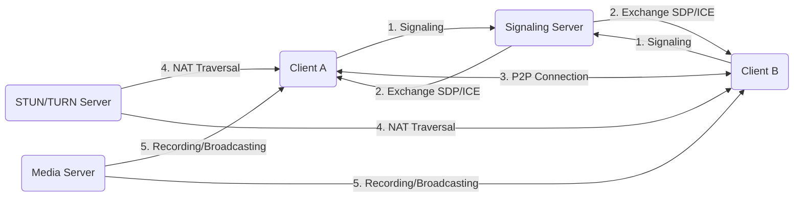
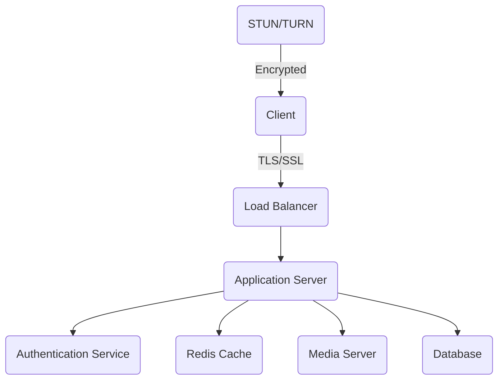
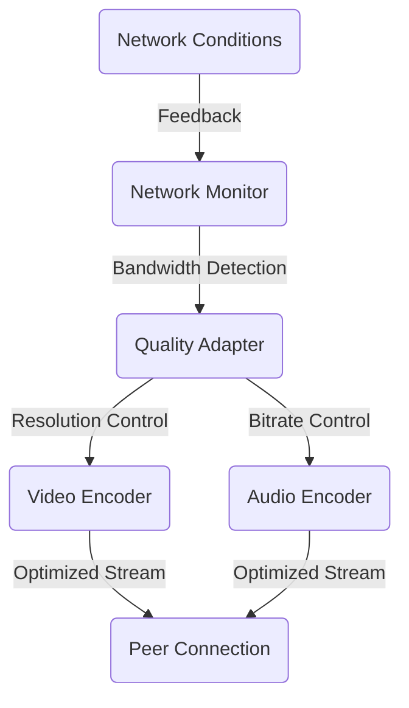

# 🎥 WebRTC Video Counseling Application

A secure and performant video counseling platform built with React, Node.js, and WebRTC.

## ✨ Features

- 📹 Real-time video communication using WebRTC
- 🔒 Secure authentication and authorization
- 📊 Media quality optimization based on network conditions
- 📁 File sharing with image optimization
- ⚡ Redis caching for improved performance
- 📝 Comprehensive logging and monitoring
- 🐳 Docker-based development environment

## 🏗️ Solution Architecture

### WebRTC Communication Flow



### System Components

#### 1. Client-Side Architecture

- **React Frontend**
  - WebRTC API integration
  - Media stream handling
  - UI/UX components
  - State management (Redux)
  - Real-time updates

#### 2. Server-Side Components

- **Signaling Server**

  - WebSocket connections
  - Session management
  - Client coordination
  - ICE candidate exchange

- **Media Server**
  - Stream processing
  - Recording capabilities
  - Broadcasting support
  - Quality optimization

#### 3. Infrastructure

- **STUN/TURN Servers**

  - NAT traversal
  - Fallback relay
  - Connection establishment

- **Redis Layer**
  - Session storage
  - Pub/Sub messaging
  - Cache management

### Security Architecture



## 🚀 Prerequisites

- 🐳 Docker and Docker Compose
- 📦 Git
- ⚙️ Node.js 18+ (for local development without Docker)

## Quick Start

1. Clone the repository:

```bash
git clone <your-repository-url>
cd WebRTC-demo
```

2. Create environment files:

```bash
cp server/.env.example server/.env
cp client/.env.example client/.env
```

3. Start the development environment:

```bash
docker-compose up
```

The application will be available at:

- Client: http://localhost:3000
- Server: http://localhost:5000
- MinIO Console: http://localhost:9001

## 🔧 Development

### 📁 Directory Structure

```
📦 WebRTC-demo
 ┣ 📂 client/                 # React frontend application
 ┃ ┣ 📂 src/                 # Source code
 ┃ ┣ 📂 public/             # Static files
 ┃ ┗ 📜 Dockerfile.dev      # Development Dockerfile
 ┣ 📂 server/                # Node.js backend application
 ┃ ┣ 📂 src/                # Source code
 ┃ ┣ 📂 migrations/         # Database migrations
 ┃ ┗ 📜 Dockerfile.dev      # Development Dockerfile
 ┗ 📜 docker-compose.yml    # Docker Compose configuration
```

### Environment Variables

Required environment variables are documented in:

- `server/.env.example`
- `client/.env.example`

### Working with Docker

Start all services:

```bash
docker-compose up
```

Start specific service:

```bash
docker-compose up <service-name>
```

Rebuild containers:

```bash
docker-compose up --build
```

View logs:

```bash
docker-compose logs -f [service-name]
```

### Database Migrations

Run migrations:

```bash
docker-compose exec server npm run migrate up
```

Create new migration:

```bash
docker-compose exec server npm run migrate create my_migration_name
```

### Testing

Run tests:

```bash
# Client tests
docker-compose exec client npm test

# Server tests
docker-compose exec server npm test
```

### Code Quality

Run linting:

```bash
# Client
docker-compose exec client npm run lint

# Server
docker-compose exec server npm run lint
```

Format code:

```bash
# Client
docker-compose exec client npm run format

# Server
docker-compose exec server npm run format
```

## 🔐 Security Features

- 🛡️ Content Security Policy (CSP) headers
- 🚫 Rate limiting for API and WebRTC endpoints
- 🧹 Input sanitization
- 🔒 Secure session management with Redis
- 🌐 CORS protection
- 🛑 XSS prevention
- 🔏 Secure WebRTC configurations

## ⚡ Performance Optimizations

- 🔄 Connection pooling for database
- 💾 Redis caching
- 📊 Media quality management
- 🖼️ Image optimization
- 🖥️ Hardware acceleration support
- 🎤 Echo cancellation and noise suppression
- 📡 WebRTC bandwidth adaptation
- 📈 Automatic quality scaling
- 🌐 Network resilience with ICE/TURN/STUN configurations

### WebRTC Quality of Service



## 📝 Deployment

### Production Setup

```bash
# Build and start production containers
docker-compose -f docker-compose.prod.yml up -d

# Monitor production logs
docker-compose -f docker-compose.prod.yml logs -f
```

### SSL Configuration

For production deployment, SSL certificates are required for WebRTC to work properly:

1. Obtain SSL certificates (e.g., from Let's Encrypt)
2. Place them in the `docker/nginx/certs` directory
3. Update the nginx configuration in `docker/nginx/nginx.conf`

### Scaling

The application supports horizontal scaling:

- WebSocket servers with Redis pub/sub
- Media servers with load balancing
- Database replication for read scaling

### Monitoring

- Prometheus metrics for system monitoring
- Grafana dashboards for visualization
- WebRTC statistics monitoring
- Error tracking and alerting

## 🤝 Contributing

1. Fork the repository
2. Create your feature branch (`git checkout -b feature/amazing-feature`)
3. Commit your changes (`git commit -m 'Add some amazing feature'`)
4. Push to the branch (`git push origin feature/amazing-feature`)
5. Open a Pull Request

## 📝 License

This project is licensed under the MIT License - see the LICENSE file for details.
